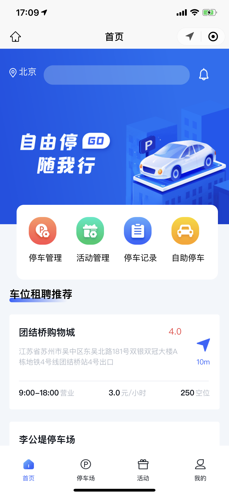
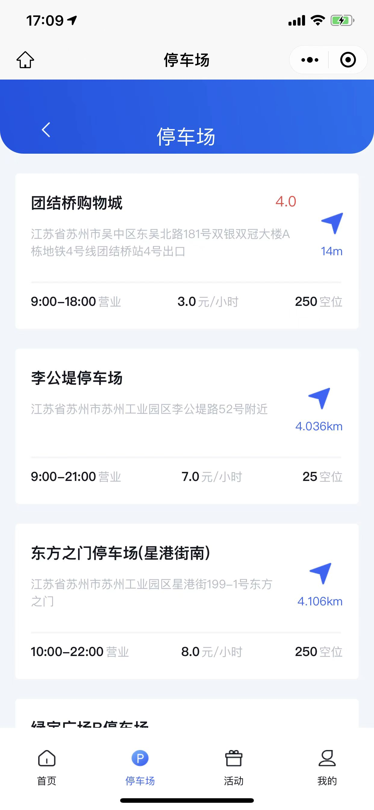

# 自由停

用 Vue 实现停车小程序

<br />

<p align="center">
  <a href="https://github.com/laoycz/freepark">
    
  </a>

</p>

## 目录

- [上手指南](#上手指南)
  - [开发前的配置要求](#开发前的配置要求)
  - [安装步骤](#安装步骤)
- [文件目录说明](#文件目录说明)
- [开发的架构](#开发的架构)
- [使用到的框架](#使用到的框架)
- [游戏截图](#游戏截图)

### 上手指南

#### 开发前的配置要求

1. 微信开发者工具
2. Node.js - pnpm

#### **安装步骤**

1. Clone the repo
2. pnpm install --shamefully-hoist
3. pnpm dev:mp-weixin
4. 用微信开发者工具打开 dist/dev/mp-weixin

```sh
git clone https://github.com/laoycz/freepark
```

### 文件目录说明

```
├── index.html
├── package.json
├── pnpm-lock.yaml
├── src
│   ├── App.vue
│   ├── main.js
│   ├── manifest.json
│   ├── pages
│   │   ├── activity
│   │   │   └── index.vue
│   │   ├── completed
│   │   │   ├── index.vue
│   │   │   └── score.vue
│   │   ├── home
│   │   │   ├── index.vue
│   │   │   ├── nav-link.vue
│   │   │   └── nav.vue
│   │   ├── index
│   │   │   └── index.vue
│   │   ├── my
│   │   │   ├── index.vue
│   │   │   └── plate.vue
│   │   ├── park
│   │   │   ├── create.vue
│   │   │   ├── index.vue
│   │   │   └── parks.vue
│   │   ├── sign
│   │   │   └── index.vue
│   │   └── whole
│   │       └── index.vue
│   ├── pages.json
│   ├── static
│   │   ├── activity
│   │   ├── home
│   │   ├── nav
│   │   ├── sign
│   │   └── slices
│   └── uni.scss
├── tailwind.config.js
└── vite.config.js
```

### 开发的架构

使用 uni-app cli 模式生成小程序框架

### 使用到的框架

- [Vue](https://vuejs.org/)
- [uni-app](https://uniapp.dcloud.net.cn/)
- [微信开发者工具](https://developers.weixin.qq.com/miniprogram/dev/devtools/devtools.html)

### 游戏截图

<div>
  
  
  
  
</div>
